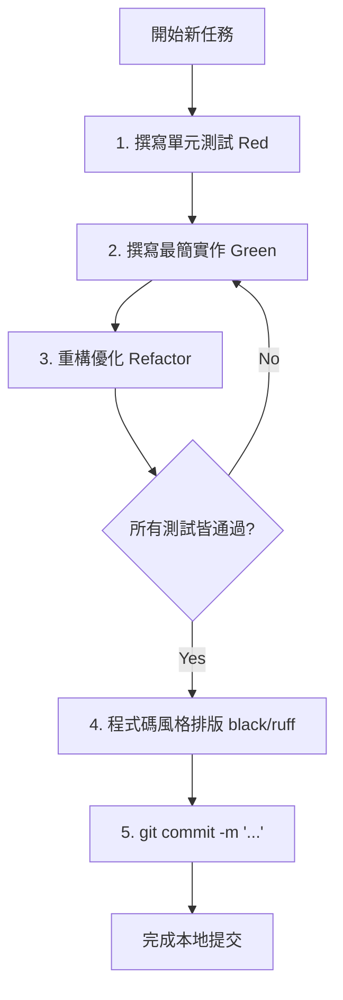

# FitRaceStudio 開發規範與指南 (AGENT.md)

本文件定義了 **FitRaceStudio** 專案的開發指南。專案中的所有模組都必須遵循 **Clean Architecture (乾淨架構)** 進行設計，並以 **TDD (測試驅動開發)** 作為核心開發流程，在測試通過後方可 Commit 至本地 Git 倉庫。

---

## 1. 開發語言與技術棧選擇

為了配合樹莓派與有氧設備 BLE / FTMS 的穩定連線、以及非同步 MQTT/WebSocket 數據串流傳輸，專案**統一採用 Python (3.11+)** 作為開發語言。

### 1.1 語言選擇考量與決策
- **核心庫穩定性**：樹莓派 Linux 環境下，Python 的 `bleak` 庫是目前最成熟、維護最活躍的非同步 BLE 協議庫，相較於 Node.js 或 Go 能提供最穩定的 FTMS 連線和自動重連機制。
- **非同步事件驅動設計**：利用 Python 3.11+ 的 `asyncio`、`FastAPI` (Hub 端) 以及非同步 MQTT 客戶端 (Edge 端)，能以簡潔的程式碼滿足低延遲即時遙測傳輸。
- **TDD 與開發效率**：使用 `pytest` + `pytest-asyncio` 能快速進行紅綠燈測試，極大縮短原型到試點的迭代週期。

---

## 2. 乾淨架構 (Clean Architecture) 規範

為了確保系統的**高可測試性**、**低耦合性**以及**與外部框架/硬體驅動的解耦**，本專案依循 Clean Architecture 設計。

### 2.1 核心原則：依賴性規則 (Dependency Rule)
- 依賴關係只能**由外向內**單向指向。
- 內層（例如領域實體與案例）絕不能知道或依賴外層（例如 FastAPI、MQTT 代理、Bleak 藍牙庫或具體資料庫）的任何細節。
- 跨層傳遞數據時，應使用簡單的數據結構（如 Python 原生 Dict、NamedTuple 或 Pydantic 數據模型，依層級而定）。

```text
       +---------------------------------------------+
       |           Frameworks & Drivers              |
       |  (FastAPI, Bleak FTMS, Local Web, MQTT, DB) |
       |       +-------------------------------------+
       |       |          Interface Adapters         |
       |       |      (Controllers, Gateways)        |
       |       |       +-----------------------------+
       |       |       |         Use Cases           |
       |       |       |    (Application Business)   |
       |       |       |       +---------------------+
       |       |       |       |      Entities       |
       |       |       |       |  (Enterprise Biz)   |
       |       |       |       +---------------------+
       +-------+-------+-------+---------------------+
                       Inner Layers (High Abstraction) <--- Outer Layers (Low Abstraction)
```

### 2.2 四層架構結構與對應目錄

每個子系統（如 `edge_node` 與 `hub_server`）都應遵循以下目錄結構：

```text
<module_name>/
├── domain/               # 1. Entities 層：定義核心業務模型與規則
│   ├── __init__.py
│   └── models.py         # 例如：TelemetryData, RaceState
│
├── usecases/             # 2. Use Cases 層：協調業務流程，定義操作介面
│   ├── __init__.py
│   ├── interfaces.py     # 外部依賴的抽象介面 (Port/Gateways)
│   └── race_manager.py   # 具體應用場景邏輯
│
├── adapters/             # 3. Interface Adapters 層：介面與傳輸協議轉譯
│   ├── __init__.py
│   ├── mqtt_presenter.py # 格式化為 MQTT Payload
│   ├── ftms_controller.py # 接收並轉譯 FTMS 遙測
│   └── repositories.py   # 資料庫/狀態暫存之適配器
│
└── infrastructure/       # 4. Frameworks & Drivers 層：具體框架與第三方庫
    ├── __init__.py
    ├── fastapi/          # Web 伺服器與路由
    ├── locales/          # i18n 語言翻譯包字典 (如 zh_tw.json, en.json)
    ├── ble/              # bleak 實際 FTMS 取值驅動
    ├── web/              # Edge Node 本機 Web 設定服務
    ├── mqtt/             # gmqtt/paho-mqtt 實際連線客戶端
    └── database/         # 資料庫連線與 SQL 實作
```

### 2.3 多國語系 (i18n) 實作原則
- **語言包存放**：多國語系字典檔放置於 `infrastructure/locales/` 目錄下，確保核心邏輯與語系文字完全解耦。
- **介面傳遞**：介面適配器層應透過 API 提供語系轉換的查詢介面，由後端服務集中交付翻譯檔。
- **前端語系轉換**：前端介面（網頁看板及 App）應透過拉取 API 動態更新 UI 詞條對照，禁止在靜態網頁中寫死中英文翻譯字串。

---

## 3. 測試驅動開發 (TDD) 流程

所有新功能與 bug 修復都必須使用 **TDD** 進行。

### 3.1 TDD 循環 (Red-Green-Refactor)

1. **紅燈 (Red)**：在撰寫任何實作程式碼之前，先在 `tests/` 目錄寫下測試案例。執行測試，確保其**失敗**（確認測試有效且能抓到未實作的狀態）。
2. **綠燈 (Green)**：撰寫**最少、最快**的實作程式碼，直到測試**通過**為止。此時不要追求完美的程式碼設計。
3. **重構 (Refactor)**：在測試保護下，優化程式碼結構、消除重複、提升可讀性與效能。每次重構後，必須再次執行測試並保持**綠燈**。

### 2.2 測試框架與執行指令
我們使用 `pytest` 作為主要測試工具。若有非同步協程，應搭配 `pytest-asyncio`。

- **執行所有測試**：
  ```bash
  pytest
  ```
- **執行特定檔案的測試**：
  ```bash
  pytest tests/unit/test_telemetry_parser.py
  ```
- **看見輸出細節與測試覆蓋率**：
  ```bash
  pytest -v --cov=.
  ```

### 2.3 TDD 實戰範例 (以設備遙測轉譯器 TelemetryParser 為例)

#### 步驟 1：紅燈 (Red) - 先寫測試
在 `tests/unit/test_telemetry.py` 中寫下預期的行為測試：

```python
# file: tests/unit/test_telemetry.py
import pytest
from edge_node.domain.models import TelemetryData
from edge_node.usecases.telemetry_parser import parse_ftms_speed

def test_parse_ftms_speed_valid_bytes():
    # 假設 FTMS 藍牙 Speed 特徵值前兩個位元組代表速度 (單位為 0.01 km/h)
    raw_data = bytes([0x01, 0x00]) # 0x0001 = 1 -> 0.01 km/h
    expected_kph = 0.01
    
    result = parse_ftms_speed(raw_data)
    assert result == expected_kph

def test_parse_ftms_speed_empty_bytes():
    with pytest.raises(ValueError):
        parse_ftms_speed(bytes([]))
```
*執行 `pytest`：測試應失敗（找不到 `parse_ftms_speed` 模組或函數）。*

#### 步驟 2：綠燈 (Green) - 撰寫最簡實作
在 `edge_node/usecases/telemetry_parser.py` 中寫入最簡單能讓測試通過的程式碼：

```python
# file: edge_node/usecases/telemetry_parser.py

def parse_ftms_speed(raw_bytes: bytes) -> float:
    if not raw_bytes:
        raise ValueError("Raw bytes cannot be empty")
    # 最簡單的位元組轉換
    speed_raw = int.from_bytes(raw_bytes[:2], byteorder='little')
    return speed_raw / 100.0
```
*執行 `pytest`：測試通過，亮起綠燈。*

#### 步驟 3：重構 (Refactor)
若有多個解析邏輯，可以重構程式碼，例如將二進位解析抽取至輔助工具類，或優化邊界處理，每次重構皆需執行 `pytest` 確認無 Regression。

---

## 4. 本地 Commit 流程

在將程式碼 Commit 至本地 Git 倉庫前，必須完成以下品質檢驗流程。

### 3.1 Commit 前置檢查清單 (Pre-commit Checklist)

1. **單元測試與整合測試**
   - 在專案根目錄下執行 `pytest`。
   - **所有測試必須全部 Pass**。若有任何一個測試 Fail，嚴禁 Commit。
2. **程式碼風格檢查**
   - 執行格式化工具，以確保程式碼風格一致：
     ```bash
     black .
     ruff check . --fix
     ```
3. **無暫存偵錯程式碼**
   - 檢查程式碼中是否殘留 `print()`、`breakpoint()`、或 mock 調試邏輯。

### 3.2 Commit 訊息規範 (Conventional Commits)

Commit 訊息請遵循結構化格式：`<type>(<scope>): <description>`。

#### 常見 `<type>` 類型：
- `feat`: 新增功能
- `fix`: 修復 Bug
- `test`: 新增或修改測試程式碼
- `refactor`: 程式碼重構（無功能變更、無 Bug 修復）
- `docs`: 僅修改文件（如 README.md, AGENT.md）
- `chore`: 建置流程、輔助工具或依賴庫的變動（無源碼修改）

#### 範例：
```bash
git add .
git commit -m "test(edge): add unit tests for FTMS treadmill telemetry parser"
git commit -m "feat(edge): implement BLE FTMS treadmill speed parsing"
git commit -m "refactor(hub): decouple WS manager from FastAPI routes"
```

---

## 5. 本地 Git 工作流

我們採用漸進式、小步快跑的本地提交模式：



透過嚴格遵循此流程，我們能確保主幹分支程式碼永遠處於綠燈（可編譯、可執行、測試通過）狀態。
