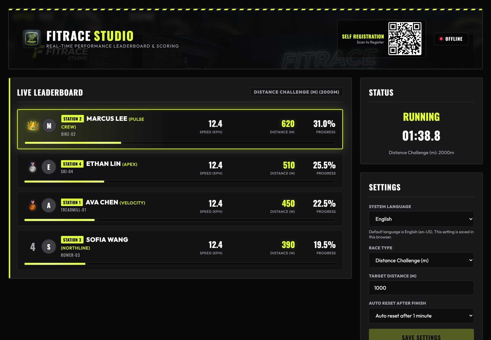
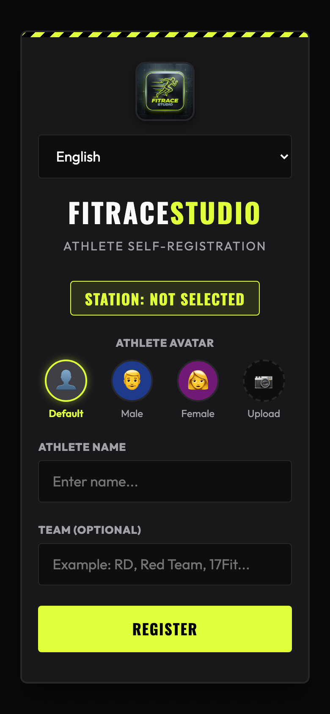
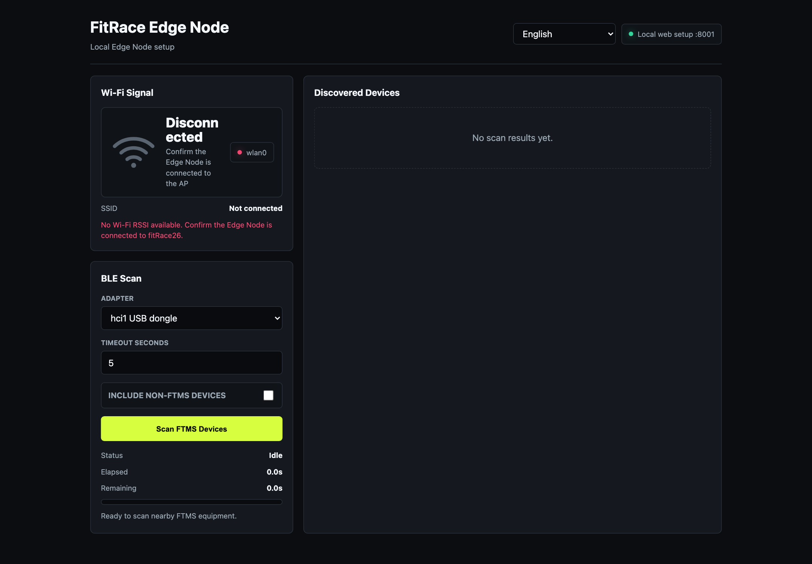

# FitRaceStudio Feature Overview

Updated: 2026-06-17

## What FitRaceStudio Does

FitRaceStudio is a real-time fitness race system for studios, gyms, events, and group training sessions. It turns connected cardio equipment into a live competition experience with athlete self-registration, station assignment, race control, and a large-screen leaderboard.

The system is designed for in-studio use. Coaches, staff, and event operators can set up stations, register athletes, start a race, and display progress on a shared dashboard.

## Main User Benefits

- Run live cardio races in a studio or event space.
- Show athlete progress on a large screen in real time.
- Let athletes register from their phones by station.
- Assign equipment to numbered stations for clear on-site operation.
- Support multiple equipment types in one race.
- Provide a local Edge setup screen for equipment discovery and signal checks.
- Switch interface language for international environments.

## Supported Race Experience

FitRaceStudio supports several competition formats:

- Distance challenge
- Time challenge
- Calories challenge
- Max power challenge
- Watt-based challenge

During a race, the dashboard shows the current race state, elapsed time, athlete ranking, speed, distance, and progress percentage.

## System Screens

### Live Race Dashboard

The dashboard is designed for a studio display or event screen. It highlights the active race, leaderboard positions, station numbers, athlete names, teams, equipment labels, and progress.

### Athlete Self-Registration

Athletes can register from a mobile-friendly page. They can choose or upload an avatar, enter their name, add an optional team name, and submit registration for the selected station.

### Edge Node Setup

The Edge Node setup screen helps staff check local signal status and discover nearby fitness equipment before or during setup.

## Feature Summary

### Live Leaderboard

- Displays current ranking during the race.
- Shows athlete name, team, station number, equipment label, distance, speed, and progress.
- Highlights the leading participant.
- Updates the race state and timer on the main display.

### Race Setup

- Select race type.
- Set target distance, time, calories, or challenge duration.
- Start, stop, close, or reset a race.
- Keep the operator workflow simple for event staff.

### Station Management

- Assign connected devices to numbered stations.
- View which stations already have athletes registered.
- See unassigned equipment before the race starts.
- Keep physical equipment layout aligned with the screen.

### Athlete Registration

- Register by station.
- Enter athlete name and optional team name.
- Use default avatar options or upload a custom avatar.
- Update the dashboard immediately after registration.

### Equipment and Edge Setup

- View local setup status for an Edge Node.
- Check Wi-Fi signal status.
- Scan for nearby FTMS-compatible fitness equipment.
- Review discovered devices during installation or troubleshooting.

### Multi-Language Interface

- The user interface supports multiple languages.
- Operators can switch the dashboard language from the screen settings.
- Registration screens are ready for international event use.

## Typical Event Flow

1. Staff open the operator screen and prepare available equipment.
2. Equipment is assigned to numbered stations.
3. Athletes scan a station QR code or open the registration page.
4. Athletes enter their name, team, and avatar.
5. Staff select a race type and target.
6. The race starts and the dashboard updates live.
7. The leaderboard shows ranking, progress, and final results.

## Ideal Use Cases

- Gym floor challenges
- Studio class competitions
- Brand activation events
- Corporate wellness races
- Multi-station cardio tournaments
- Coach-led performance sessions

## Current Product Status

The current application includes the main dashboard, registration flow, station assignment, Edge setup screen, race state display, multilingual interface, and live race presentation screens.

Some hardware-specific production features, such as final equipment board integration and over-the-air update rollout, are planned as part of the productization phase.
